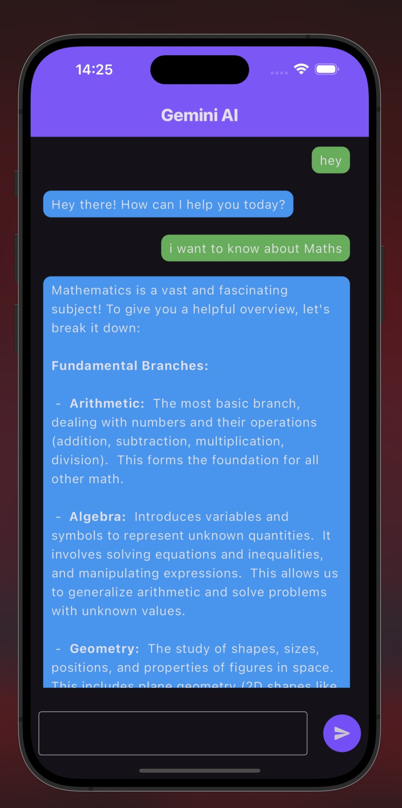
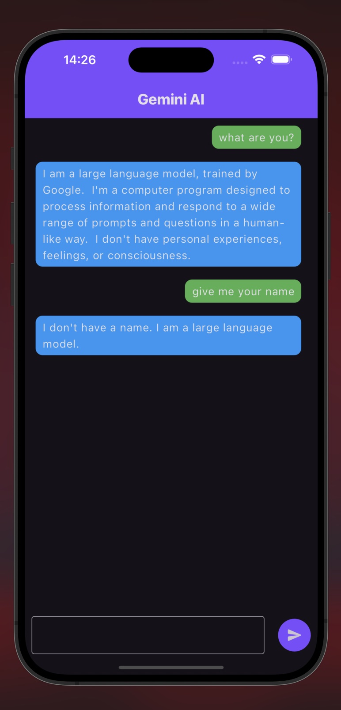

# ChatBot

**Chat with Gemini AI in Real-Time**

## Overview

ChatBot is a Flutter-based app that allows users to chat with Gemini AI using Google’s Gemini API. The app features a simple, intuitive chat interface and supports continuous conversations with intelligent, real-time responses.

## Features

- **Real-Time Chat**: Send messages and receive instant replies from Gemini AI.
- **Conversation History**: View previous chat messages in a clean chat layout.
- **Easy API Setup**: Just plug in your Gemini API key and start chatting.
- **Clean UI**: Minimalist design for distraction-free conversations.

### Chat Interface & Conversation View

---

<p float="left">
  
  &nbsp;&nbsp;&nbsp;
  
</p>

## Installation and Usage (End Users)

### Prerequisites

- **Flutter SDK** (version 3.0 or above)
- Android/iOS Emulator or Physical Device

### Installation

1. **Get Your Gemini API Key**

   - Go to [Google AI Studio](https://aistudio.google.com/app/apikey).
   - Sign in with your Google account.
   - Generate an API key and copy it.

2. **Clone the Repository**

   ```bash
   git clone https://github.com/RABIYASULTANA/chatbot.git
   cd chatbot
   ```

   - Alternatively, download the zip file:
     - Download from [here](https://github.com/hussainkazarani/trendview/archive/refs/heads/main.zip).
     - Unextract the zip file.

3. **API Key Setup**

   - Open `lib/api_home.dart`.
   - Replace the placeholder with your API key:
     ```dart
     const String apiKey = "YOUR_API_KEY_HERE";
     ```

4. **Install Dependencies**

   ```bash
   flutter pub get
   ```

5. **Run the App**
   ```bash
   flutter run
   ```
